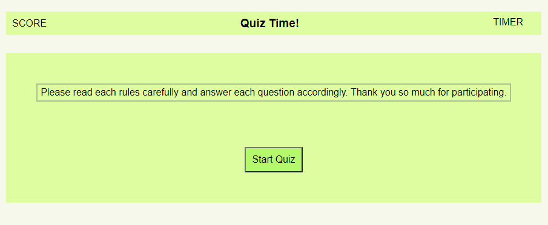
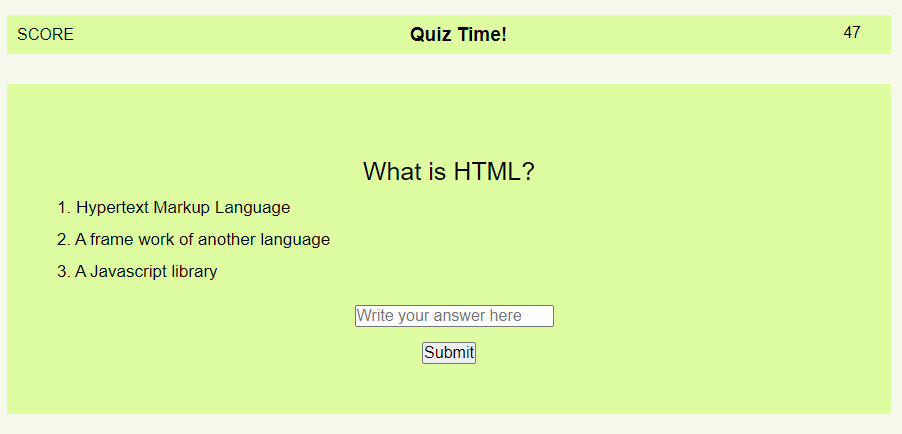
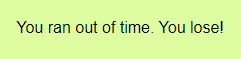
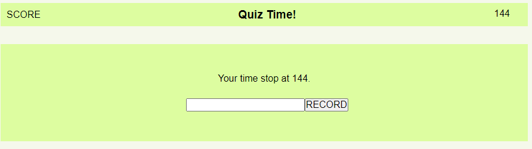

Hello, welcome to my quiz page. 

In this application, player will have 50 second to answer 10 questions. When player answer a question right, timer will go up 15 second. If player answer the question wrong, timer will go down by 10 second.  All ten questions are related to programming and coding. 

This is how the page should look when player first open application.  There will be a button to start whenever the player is ready. The timer is up to the top-right corner.

When player is ready and click on the "Start Quiz" button, this is what will pop up.  The timer will start counting down. The first question will pop up along with three options to input into the input box. 

If player ran out of time, a message will pop up indicating that player has lost the game. 

Whenever player finish with quiz and also have time left. This is what player will see.  Player is given an option to put in their name and record their score. When player click on "score" on top-left, there will be names and score of those who record it. 

This is the link to go straight to the application from here. [quiz-time](https://luckylobster25.github.io/Homework-quiz/)